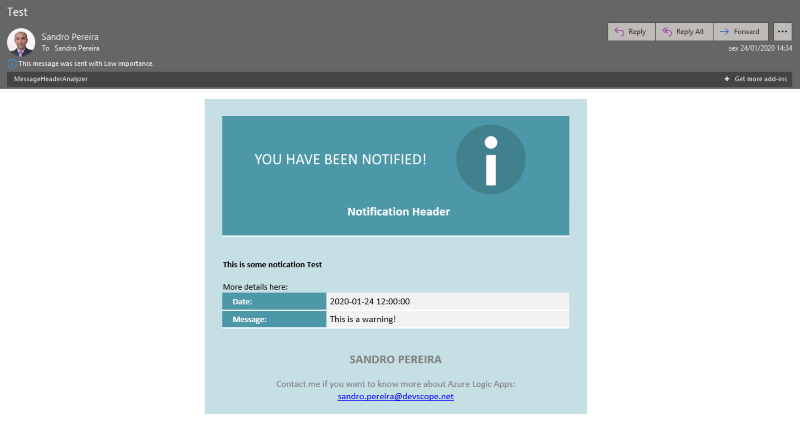

# HTML Body Notification Template to use Logic App or Power Automate Outlook connector
This is a custom HTML template that you can use inside Logic Apps or Power Automate (Flow) to send a fancy notification emails when using a Office 265 Outlook connector.

# About Us
**Sandro Pereira** | [DevScope](http://www.devscope.net/) | MVP & MCTS BizTalk Server 2010 | [https://blog.sandro-pereira.com/](https://blog.sandro-pereira.com/) | [@sandro_asp](https://twitter.com/sandro_asp)

**Pedro Rosa** | ARMIS | Software Developer | [https://www.linkedin.com/in/pedro-rosa-421b62a4/]